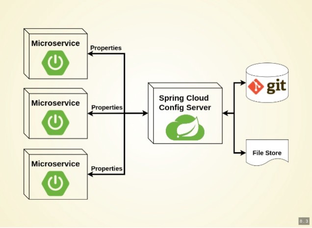

# Spring Cloud Config


Esse projeto tem como objetivo ser um exemplo simples de implementação de um serviço Spring Cloud Config e um serviço Rest que utiliza dele para consumir suas configurações.

## Introdução 

Quando estamos criando um microsserviço o primeiro, o primeiro ponto que nos deparamos é como devemos configurar nossa aplicação. Como destacados no [3º tópico (Configurações) do 12 Factor](https://12factor.net/pt_br/config), as configurações devem estar em arquivos e não em váriavies de ambiente ou diretamente no código, pois, uma aplicação deve poder ser iniciada sem a dependência de váriavies do sistema. Na stack Spring, muitas configurações ficam no application.properties (ou yml).

Inicialmente essas configurações não mudam, mas existem coisas como a URL de conexão com banco de dados ou features que dependem de flags que indicam qual deve ser sua ação. Para isso ser alterado, é necessário parar a aplicação e fazer um novo deploy com as alterações necessárias.



A fim de solucionar esse problema, precisamos de um remote config. Esse projeto exemplo, traz uma implementação do Spring Cloud Config, que tem como objetivo ser um microsserviço que disponibiliza essas configurações para outros microsserviços utilizarem.  A partir da alteração dessas configurações, com apenas a chamada de um end-point Rest é possível alterar as configurações do projeto em produção. Normalmente os arquivos de configurações são disponibilizados em um versionador, no nosso caso o GitHub. Como indica a imagem: 


## Requisitos
* `Java`
* `Maven`
* `Uma IDE com suporte à Spring`

## Arquivos de configurações dos projetos Spring Cloud Config Applcation

Para aplicações Spring Cloud Application, é necessário especificar o spring.application.name e spring.cloud.config.server.git.uri no cado do servidor e spring.cloud.config.uri no caso do client. Essas configurações são feitas utilizam o arquivo bootstrap (.properties ou .yml), que gera um contexto acima do application, sendo assim, eles são lidos antes das configurações application (.properties ou .yml).

## Vamos começar


### Server

Vamos primeiro criar nosso servidor Spring Cloud Config Server. No [Spring Initializr](https://start.spring.io/), crie um projeto que possui apenas a dependência **Config Server**. 

Agora abra na sua IDE e importe um projeto Maven, na classe Application que contem nosso main, adicione a anotação *@EnableConfigServer*. 

```java
@EnableConfigServer
@SpringBootApplication
public class SpringCloudConfigApplication {

	public static void main(String[] args) {
		SpringApplication.run(SpringCloudConfigApplication.class, args);
	}
}
```

Agora devemos configurar nossos arquivos boostrap e application:

* boostrap.properties:

```
spring.cloud.config.server.git.uri: https://github.com/brunoalbrito/spring-cloud-config/
#Para utilizar arquivos localmente
#spring.cloud.config.server.git.uri=file:///C:/Users/Bruno/Documents/spring-cloud-config
spring.cloud.config.server.git.searchPaths=configuration-properties
spring.cloud.config.server.git.skip-ssl-validation=true
management.security.enabled=false
```

* application.properties:

```
spring.application.name=spring-cloud-config-server
server.port=8980

spring.main.banner-mode=off
```


### Client

Já no Cliente vamos criar um projeto com as depêndencias:

* **Spring Web Starter**
* **Config Client**
* **Spring Boot Actuator**

Na nossa Controller vamos adicionar a seguinte estrutura:

```java
@RefreshScope
@RestController
@RequestMapping("/api")
public class MessageResource {

	@Value("${message: Default Hello}")
	private String message;

	@GetMapping("/message")
	public String message() {
		return message;
	}
}
```

E os arquivos de configuração conforme o exemplo:

* boostrap.properties:

```
spring.application.name=config-client
spring.cloud.config.uri=http://localhost:8980
management.security.enabled=false
management.endpoints.web.exposure.include=*
```

* application.properties:

```
server.port=8080
spring.main.banner-mode=off
```

## Vamos Testar

Agora podemos dar um start nas nossas aplicações:

1. Primeiro vamos ligar nosso serviço: 
Acessando o http://localhost:8080/api/message, vamos obter como retorno a mensagem padrão quando as configurações não foram associadas ao projeto.

2. Agora podemos dar um start na nossa aplicação server e podemos acessar o endereço para verificar se ela está conseguindo acessar os arquivos de configuração:

3. Nesse passa, vamos rodar executar uma requisição para que nosso cliente chame o servidor, fazendo com que ele busque as configurações e as traga para aplicação cliente.

## Considerações

Chegamos ao fim de nosso projeto básico, abaixo estão às referências de onde foram consumidos materias para construtir esse projeto.


## Licença 
[](http://badges.mit-license.org)

Este projeto está sob a MIT License - veja o arquivo [LICENSE](./LICENSE) para mais detalhes.

### Desenvolvido por: 
* Bruno Albuquerque Brito - [LinkedIn](https://www.linkedin.com/in/bruno-albuquerque-brito-07258590)